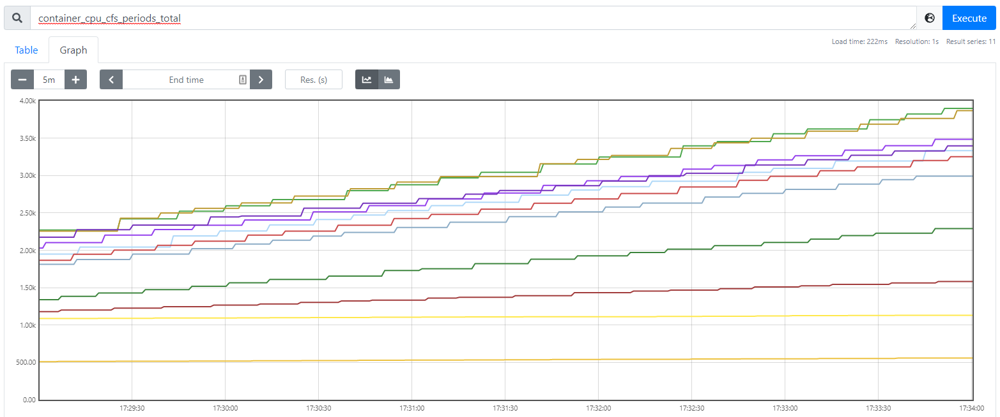
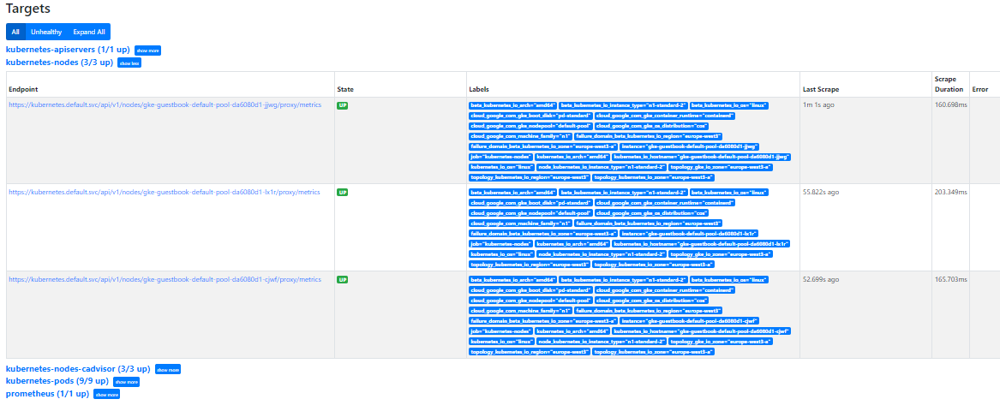
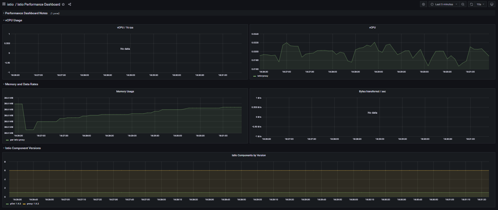
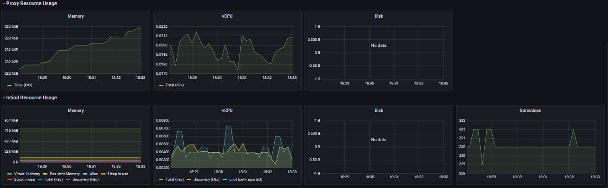
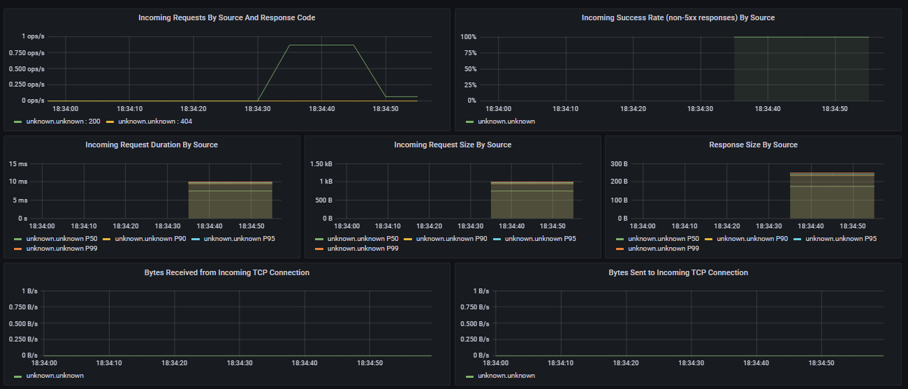
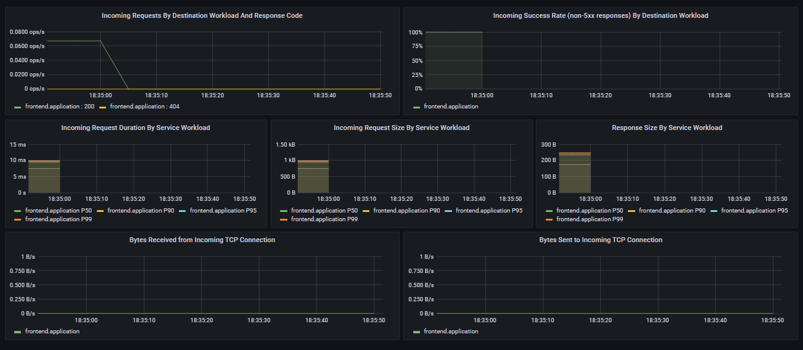

## Q1
    vagrant@mgmt:~/labs/k8scloudmesh$ terraform init
    Initializing modules...
    - gcp_gke in gcp_gke
    - gcp_k8s in gcp_k8s

    Initializing the backend...

    Initializing provider plugins...
    - Finding latest version of hashicorp/google...
    - Finding latest version of hashicorp/kubernetes...
    - Finding hashicorp/helm versions matching "2.3.0"...
    - Finding gavinbunney/kubectl versions matching "1.13.0"...
    - Installing hashicorp/google v4.0.0...
    - Installed hashicorp/google v4.0.0 (signed by HashiCorp)
    - Installing hashicorp/kubernetes v2.6.1...
    - Installed hashicorp/kubernetes v2.6.1 (signed by HashiCorp)
    - Installing hashicorp/helm v2.3.0...
    - Installed hashicorp/helm v2.3.0 (signed by HashiCorp)
    - Installing gavinbunney/kubectl v1.13.0...
    - Installed gavinbunney/kubectl v1.13.0 (self-signed, key ID AD64217B5ADD572F)

## Q02
    O ficheiro k8s-monitoring.tf é dá build/deploy das aplicações Grafana e Prometheus no Kubernetes cluster. Neste ficheiro, é especificado o path do YAML que responsavel pelo build destes serviços. Isto só é possivel se o Kubernetes cluster estiver provisioned e o ISTIO instalado.

## Q03
    O ficheiro k8s-istio.tf instala o ISTIO Service Mesh no Kubernetes cluster, permitindo fazer provisioning do Grafana e do Prometheus para monitorizar o projeto. Este processo necessita que o Kubernetes cluster esteja provisioned.

## Q04
    Estes ficheiros especificam o building dos serviços do Grafana e do Prometheus no Kubernetes Cluster.

## Q05
    vagrant@mgmt:~/labs/k8scloudmesh$ kubectl get pods -n application
        NAME                              READY   STATUS    RESTARTS   AGE
        frontend-555584b8c9-j72ck         2/2     Running   0          36m
        frontend-555584b8c9-rv2nh         2/2     Running   0          36m
        frontend-555584b8c9-tlbrp         2/2     Running   0          36m
        redis-follower-6579bcb987-8wqwr   2/2     Running   0          36m
        redis-follower-6579bcb987-gg488   2/2     Running   0          36m
        redis-leader-769c885c4f-xvtrg     2/2     Running   0          36m
            
    Como podemos ver pelo comando acima temos 6 Pods cada um tem 2 containers.

## Q6
    vagrant@mgmt:~/labs/k8scloudmesh$ kubectl get all -n istio-system
    NAME                             READY   STATUS    RESTARTS   AGE
    pod/grafana-79bd5c4498-d4k68     1/1     Running   0          59m
    pod/istiod-687f965684-szc7p      1/1     Running   0          37m
    pod/prometheus-9f4947649-zxrf5   2/2     Running   0          59m

    NAME                 TYPE           CLUSTER-IP       EXTERNAL-IP      PORT(S)                                 AGE
    service/grafana      LoadBalancer   10.123.244.63    34.141.24.88     3000:31125/TCP                          59m
    service/istiod       ClusterIP      10.123.240.9     <none>           15010/TCP,15012/TCP,443/TCP,15014/TCP   37m
    service/prometheus   LoadBalancer   10.123.242.193   34.141.125.156   9090:32560/TCP                          59m

    NAME                         READY   UP-TO-DATE   AVAILABLE   AGE
    deployment.apps/grafana      1/1     1            1           59m
    deployment.apps/istiod       1/1     1            1           37m
    deployment.apps/prometheus   1/1     1            1           59m

    NAME                                   DESIRED   CURRENT   READY   AGE
    replicaset.apps/grafana-79bd5c4498     1         1         1       59m
    replicaset.apps/istiod-687f965684      1         1         1       37m
    replicaset.apps/prometheus-9f4947649   1         1         1       59m

    NAME                                         REFERENCE           TARGETS   MINPODS   MAXPODS   REPLICAS   AGE
    horizontalpodautoscaler.autoscaling/istiod   Deployment/istiod   1%/80%    1         5         1          37m

    Existem 3 Pods com status Running (Grafana, Prometheus e istiod Pods).
    No fim do comando conseguimos verificar que existem replicas reportadas.

## Q7
    vagrant@mgmt:~/labs/k8scloudmesh$ kubectl get services --all-namespaces
    NAMESPACE      NAME                   TYPE           CLUSTER-IP       EXTERNAL-IP      PORT(S)                                 AGE
    application    frontend               LoadBalancer   10.123.247.50    34.107.123.127   80:31397/TCP                            51m
    application    redis-follower         ClusterIP      10.123.255.176   <none>           6379/TCP                                51m
    application    redis-leader           ClusterIP      10.123.249.104   <none>           6379/TCP                                51m
    default        kubernetes             ClusterIP      10.123.240.1     <none>           443/TCP                                 53m
    istio-system   grafana                LoadBalancer   10.123.253.70    35.234.102.94    3000:30537/TCP                          51m
    istio-system   istiod                 ClusterIP      10.123.253.89    <none>           15010/TCP,15012/TCP,443/TCP,15014/TCP   51m
    istio-system   prometheus             LoadBalancer   10.123.249.119   34.89.167.230    9090:30578/TCP                          51m
    kube-system    default-http-backend   NodePort       10.123.255.76    <none>           80:32535/TCP                            52m
    kube-system    kube-dns               ClusterIP      10.123.240.10    <none>           53/UDP,53/TCP                           52m
    kube-system    metrics-server         ClusterIP      10.123.253.247   <none>           443/TCP                                 52m

## Q8
    A métrica selecionada é container_cpu_cfs_periods_total.

## Q9
    As métricas no Performance Dashboard estão relacionados com a performance de Hardware. 
    As métricas são vCPU, Memory Usage, Disk...

## Q10
    As métricas no Service Dashboard estão relacionadas com a aplicação e o seu fluxo de tráfego.
    As métricas são Client/Server Request Volume, Client/Server Success Rate, Client/Server Request Duration, TCP Received/Sent Bytes, Incoming Requests...

