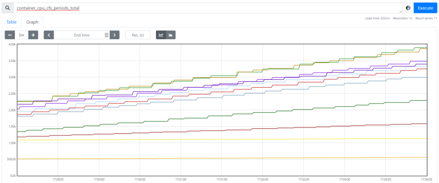
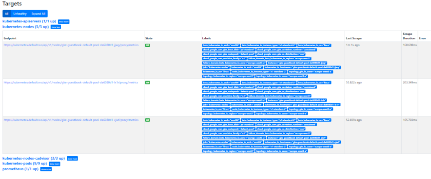
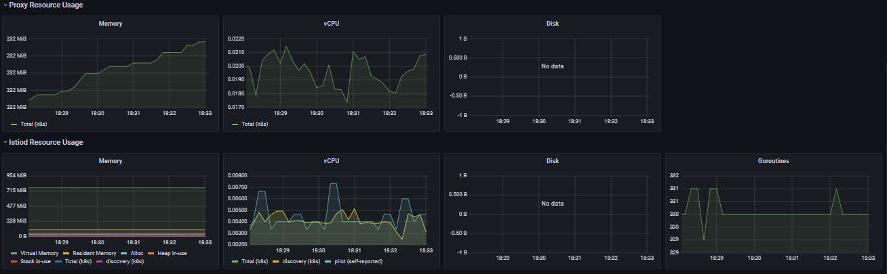
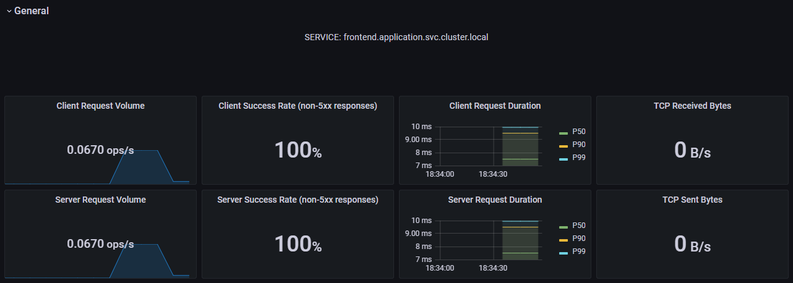
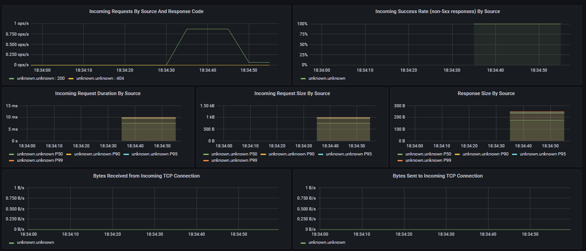
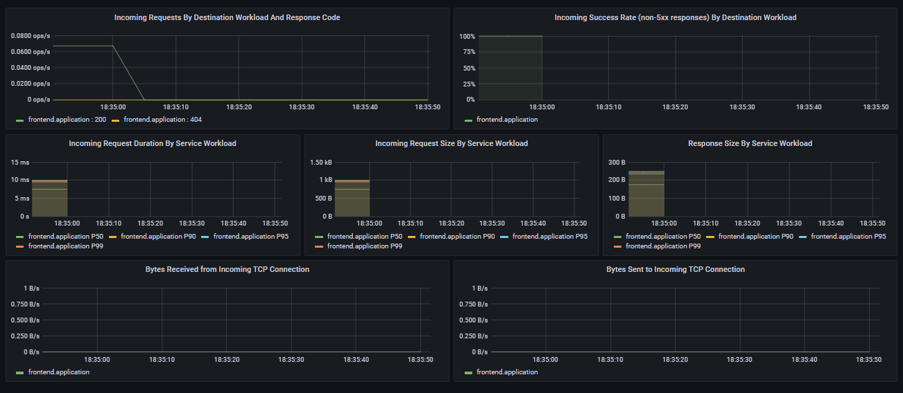

##  Deployment of a Scalable Cloud-Native Application in a High-Available Kubernetes Cluster with Service Mesh and Monitoring on a Public Cloud (Google Cloud Platform) using automation tools

# Q1
```
Initializing modules...
- gcp_gke in gcp_gke
- gcp_k8s in gcp_k8s

Initializing the backend...

Initializing provider plugins...
- Finding hashicorp/helm versions matching "2.3.0"...
- Finding gavinbunney/kubectl versions matching "1.13.0"...
- Finding latest version of hashicorp/google...
- Finding latest version of hashicorp/kubernetes...
- Installing hashicorp/helm v2.3.0...
- Installed hashicorp/helm v2.3.0 (signed by HashiCorp)
- Installing gavinbunney/kubectl v1.13.0...
- Installed gavinbunney/kubectl v1.13.0 (self-signed, key ID AD64217B5ADD572F)
- Installing hashicorp/google v4.0.0...
- Installed hashicorp/google v4.0.0 (signed by HashiCorp)
- Installing hashicorp/kubernetes v2.6.1...
- Installed hashicorp/kubernetes v2.6.1 (signed by HashiCorp)
```
# Q2
The file "k8s-monitoring.tf" is used to deploy "grafana" and "prometheus" by giving the path to the corresponding yaml file and also depends if the namespace intio_system already exists.

# Q3
The file "k8s-istio.tf" is used to deploy the istio service mesh with Helm Charts that consists in two parts the istio-base and the istio-discovery.

# Q4
The ymal files in the folder monitoring are used to configure the monitoring tools "grafana" and "prometheus".

# Q5
According with the output of the command bellow we can see that there are 2 containers for each pod.

```
vagrant@mgmt:~/labs/k8scloudmesh$ kubectl get pods -n application
NAME                              READY   STATUS    RESTARTS   AGE
frontend-555584b8c9-j72ck         2/2     Running   0          36m
frontend-555584b8c9-rv2nh         2/2     Running   0          36m
frontend-555584b8c9-tlbrp         2/2     Running   0          36m
redis-follower-6579bcb987-8wqwr   2/2     Running   0          36m
redis-follower-6579bcb987-gg488   2/2     Running   0          36m
redis-leader-769c885c4f-xvtrg     2/2     Running   0          36m
```

# Q6
As we can see from the ouput from the command bellow there are 3 pods that are running that bellong to the istio-system and exists a replicaset for each app: grafana, istiod and prometheus.  
```
vagrant@mgmt:~/labs/k8scloudmesh$ kubectl get all -n istio-system
NAME                             READY   STATUS    RESTARTS   AGE
pod/grafana-79bd5c4498-d4k68     1/1     Running   0          59m
pod/istiod-687f965684-szc7p      1/1     Running   0          37m
pod/prometheus-9f4947649-zxrf5   2/2     Running   0          59m

NAME                 TYPE           CLUSTER-IP       EXTERNAL-IP      PORT(S)                                 AGE
service/grafana      LoadBalancer   10.123.244.63    34.141.24.88     3000:31125/TCP                          59m
service/istiod       ClusterIP      10.123.240.9     <none>           15010/TCP,15012/TCP,443/TCP,15014/TCP   37m
service/prometheus   LoadBalancer   10.123.242.193   34.141.125.156   9090:32560/TCP                          59m

NAME                         READY   UP-TO-DATE   AVAILABLE   AGE
deployment.apps/grafana      1/1     1            1           59m
deployment.apps/istiod       1/1     1            1           37m
deployment.apps/prometheus   1/1     1            1           59m

NAME                                   DESIRED   CURRENT   READY   AGE
replicaset.apps/grafana-79bd5c4498     1         1         1       59m
replicaset.apps/istiod-687f965684      1         1         1       37m
replicaset.apps/prometheus-9f4947649   1         1         1       59m

NAME                                         REFERENCE           TARGETS   MINPODS   MAXPODS   REPLICAS   AGE
horizontalpodautoscaler.autoscaling/istiod   Deployment/istiod   1%/80%    1         5         1          37m
```

# Q7
```
vagrant@mgmt:~/labs/k8scloudmesh$ kubectl get services --all-namespaces
NAMESPACE      NAME                   TYPE           CLUSTER-IP       EXTERNAL-IP      PORT(S)                                 AGE
application    frontend               LoadBalancer   10.123.247.50    34.107.123.127   80:31397/TCP                            51m
application    redis-follower         ClusterIP      10.123.255.176   <none>           6379/TCP                                51m
application    redis-leader           ClusterIP      10.123.249.104   <none>           6379/TCP                                51m
default        kubernetes             ClusterIP      10.123.240.1     <none>           443/TCP                                 53m
istio-system   grafana                LoadBalancer   10.123.253.70    35.234.102.94    3000:30537/TCP                          51m
istio-system   istiod                 ClusterIP      10.123.253.89    <none>           15010/TCP,15012/TCP,443/TCP,15014/TCP   51m
istio-system   prometheus             LoadBalancer   10.123.249.119   34.89.167.230    9090:30578/TCP                          51m
kube-system    default-http-backend   NodePort       10.123.255.76    <none>           80:32535/TCP                            52m
kube-system    kube-dns               ClusterIP      10.123.240.10    <none>           53/UDP,53/TCP                           52m
kube-system    metrics-server         ClusterIP      10.123.253.247   <none>  
```

# Q8
In the first image we see the graph of the metric "container_cpu_cfs_periods_total" and in the second image we see the targets from prometheus.



# Q9
As we can see in the grafana performance dashboard we can see the vCPU, memory usage,etc.



# Q10
In the grafana service dashboard we see related data of the application like the "request volume" the success rate of the requests, and other things we can see in the images bellow.



