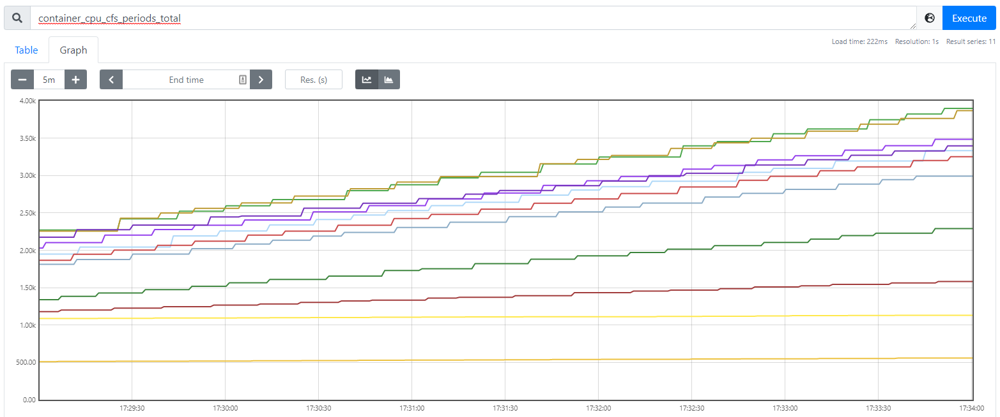
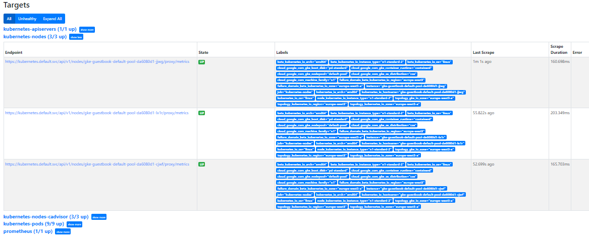
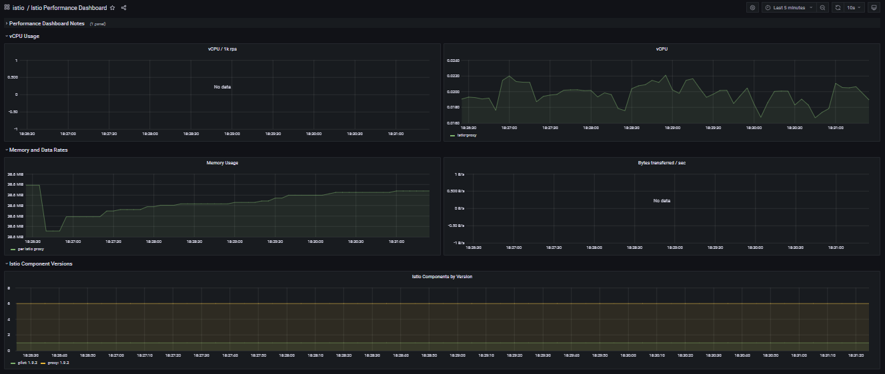
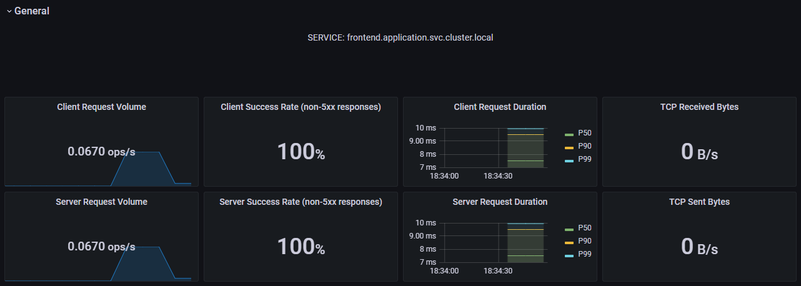

# Q01
    vagrant@mgmt:~/labs/k8scloudmesh$ terraform init
    Initializing modules...
    - gcp_gke in gcp_gke
    - gcp_k8s in gcp_k8s

    Initializing the backend...

    Initializing provider plugins...
    - Finding latest version of hashicorp/google...
    - Finding latest version of hashicorp/kubernetes...
    - Finding hashicorp/helm versions matching "2.3.0"...
    - Finding gavinbunney/kubectl versions matching "1.13.0"...
    - Installing hashicorp/google v4.0.0...
    - Installed hashicorp/google v4.0.0 (signed by HashiCorp)
    - Installing hashicorp/kubernetes v2.6.1...
    - Installed hashicorp/kubernetes v2.6.1 (signed by HashiCorp)
    - Installing hashicorp/helm v2.3.0...
    - Installed hashicorp/helm v2.3.0 (signed by HashiCorp)
    - Installing gavinbunney/kubectl v1.13.0...
    - Installed gavinbunney/kubectl v1.13.0 (self-signed, key ID AD64217B5ADD572F)
# Q02
    The purpose of the k8s-monitoring.tf file is to buid/deploy the Grafana and Prometheus applications within the Kubernetes Cluster. In this file, we specify the path for the YAML file responsible for the building of each of these services (monitoring/grafana.yaml and monitoring/prometheus.yaml) as well as the sequence needed to run these same files. Important to note that this can only happen if the Kubernetes cluster is already provisioned and ISTIO installed.
# Q03
    The purpose of the k8s-istio.tf file is to install the ISTIO Service Mesh within our Kubernetes Cluster. This will allow us to provision the Grafana and Prometheus applications (referenced in the previous answer) to enable the monitoring of our project, but it also depends on the Kubernetes cluster provisioning, as we can see within the code, in lines 15 and 27.
# Q04
    The purpose of these files is to specify the building of the Grafana and Prometheus services within the Kubernetes cluster.
# Q05
    vagrant@mgmt:~/labs/k8scloudmesh$ kubectl get pods -n application
    NAME                              READY   STATUS    RESTARTS   AGE
    frontend-555584b8c9-j72ck         2/2     Running   0          36m
    frontend-555584b8c9-rv2nh         2/2     Running   0          36m
    frontend-555584b8c9-tlbrp         2/2     Running   0          36m
    redis-follower-6579bcb987-8wqwr   2/2     Running   0          36m
    redis-follower-6579bcb987-gg488   2/2     Running   0          36m
    redis-leader-769c885c4f-xvtrg     2/2     Running   0          36m

    As we can see in the command results, there are 6 application Pods. In each pod, 2 containers were reported, specified in the 'READY' column of the command results (meaning that 2 out of 2 contaires are considered ready).
# Q06
    vagrant@mgmt:~/labs/k8scloudmesh$ kubectl get all -n istio-system
    NAME                             READY   STATUS    RESTARTS   AGE
    pod/grafana-79bd5c4498-d4k68     1/1     Running   0          59m
    pod/istiod-687f965684-szc7p      1/1     Running   0          37m
    pod/prometheus-9f4947649-zxrf5   2/2     Running   0          59m

    NAME                 TYPE           CLUSTER-IP       EXTERNAL-IP      PORT(S)                                 AGE
    service/grafana      LoadBalancer   10.123.244.63    34.141.24.88     3000:31125/TCP                          59m
    service/istiod       ClusterIP      10.123.240.9     <none>           15010/TCP,15012/TCP,443/TCP,15014/TCP   37m
    service/prometheus   LoadBalancer   10.123.242.193   34.141.125.156   9090:32560/TCP                          59m

    NAME                         READY   UP-TO-DATE   AVAILABLE   AGE
    deployment.apps/grafana      1/1     1            1           59m
    deployment.apps/istiod       1/1     1            1           37m
    deployment.apps/prometheus   1/1     1            1           59m

    NAME                                   DESIRED   CURRENT   READY   AGE
    replicaset.apps/grafana-79bd5c4498     1         1         1       59m
    replicaset.apps/istiod-687f965684      1         1         1       37m
    replicaset.apps/prometheus-9f4947649   1         1         1       59m

    NAME                                         REFERENCE           TARGETS   MINPODS   MAXPODS   REPLICAS   AGE
    horizontalpodautoscaler.autoscaling/istiod   Deployment/istiod   1%/80%    1         5         1          37m

    There were 3 Pods in state 'running', namely the Prometheus, Grafana and Istio Pods. More towards the end of the command results, we can see that there are replica sets reported, specified in the column 'REPLICAS'.
# Q07
    vagrant@mgmt:~/labs/k8scloudmesh$ kubectl get services -n application
    NAME             TYPE           CLUSTER-IP       EXTERNAL-IP      PORT(S)        AGE
    frontend         LoadBalancer   10.123.247.50    34.107.123.127   80:31397/TCP   50m
    redis-follower   ClusterIP      10.123.255.176   <none>           6379/TCP       50m
    redis-leader     ClusterIP      10.123.249.104   <none>           6379/TCP       50m
# Q08
    The metric selected was container_cpu_cfs_periods_total.

# Q09
    The metrics in the performance dashboard are related to the Hardware performance while running the application, the metrics being, for example: Memory usage, vCPU, etc.

# Q10
    The metrics in the service dashboard are related to the Application, it's usage and affluency (requests and responses). In this dashboard we can see some metrics like: Incoming Request Duration, Bytes Received from Incoming TCP Connection or Response Size By Service Workload.

