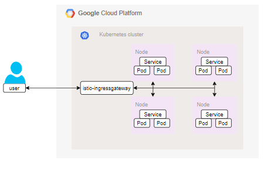
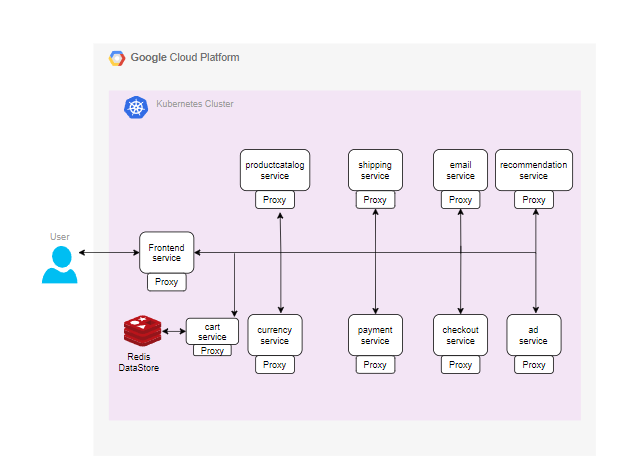

# Project Name

AGISIT 2021-2022

## Authors

**TEAM 14T**

| Number | Name              | Username                                        | Email                                               |
| -------|-------------------|-------------------------------------------------| ----------------------------------------------------|
| 102124 | Daniel Dias       | <https://git.rnl.tecnico.ulisboa.pt/ist1102124> | <mailto:daniel.g.dias@tecnico.ulisboa.pt>           |
| 98722  | Miguel Figueiredo | <https://git.rnl.tecnico.ulisboa.pt/ist198722>  | <mailto:miguel.r.figueiredo@tecnico.ulisboa.pt>     |
| 90106  | João Borges       | <https://git.rnl.tecnico.ulisboa.pt/ist190106>  | <mailto:joaomborges@tecnico.ulisboa.pt>             |

## Solution

To implement the Cloud-Native Online Boutique Application we needed to run 11 micro-services.

Frontend - Responsible for exposing an HTTP server to serve the website.
Cartservice - Responsible for storing the items in the shopping cart in Redis.
Productcatalogservice - Responsible for providing the list of products from a JSON file and searching products.
Currencyservice - Responsible for converting money currencies.
Paymentservice - Responsible for charging the credit card for the purchase.
Shippingservice - Responsible for giving shipping cost based on the shopping cart and ships the items.
Emailservice - Responsible for sending users the order confirmation email.
Checkoutservice - Responsible for retrieving user shopping cart, preparing the order and payement and the email notification.
Recommendationservice - Responsible for recommending other products based on the shopping cart.
Adservice - Responsible for providing text ads.
Loadgenerator - Responsible for sending constant requests imitating realistic user flows to the frontends.
For the Infrastructure’s Architecture, we used a Kubernetes Cluster in GCP Cloudwith 4 Worker Nodes that run the 11 micro-services referred to above.
We used Terraform that allows us to easily configure and manage the infrastructureand Kubernetes to automate the deployment, scaling and management of the applica-tion.For the micro-services,  the user make requests through Frontend service whichdelegates the request to the respective service.

## Implementation Options
Navigate to the repository of the project and apply the following commands:
1- vagrant up - Create/Initializes a VM machine with the specification in the Vagrant File.
2- vagrant ssh mgmt - Establishes a SSH Connection with the VM machine (mgmt).
3- cd "directory of the .tf files" - Navigate to the main folder.
4- gcloud auth login - Authenticates te cloud int the mgmt machine.
5- terraform init - Initializes/Install the plugins needed.
6- terraform plan - Verifies the specifications of the project.
7- terraform apply - Runs the Terraform files of the project. Provisioning of the Infrastructure and Deployment of the Application.
8- gcloud container clusters get-credentials "cluster_name" --zone "project_zone" --project "project_ID" & Connects the console with the Kubernetes Cluster.

