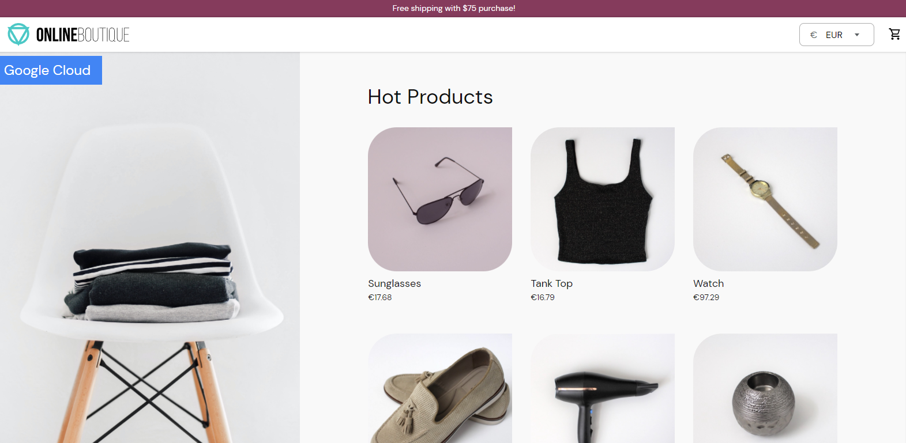
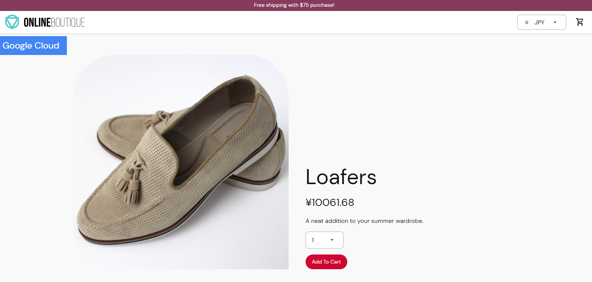
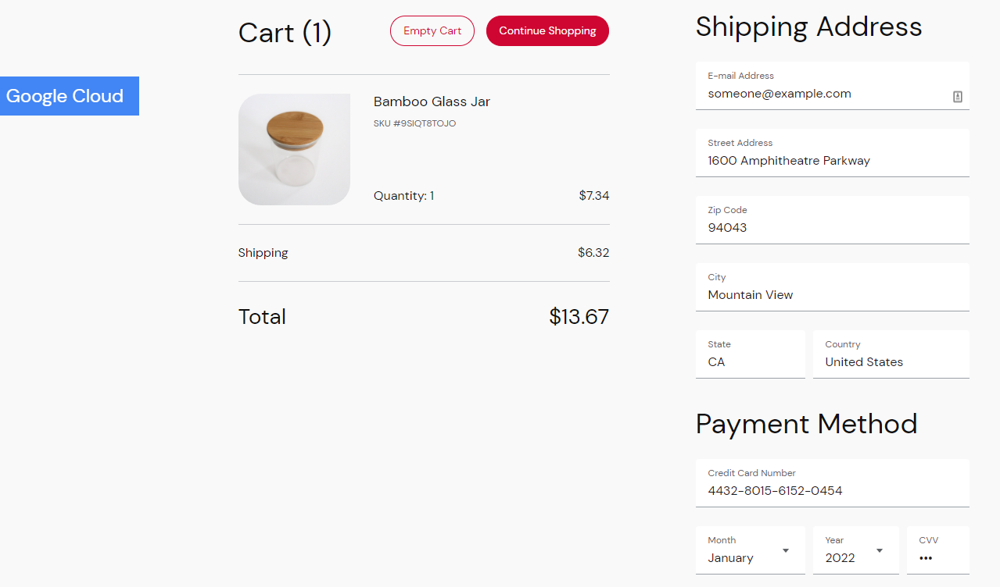
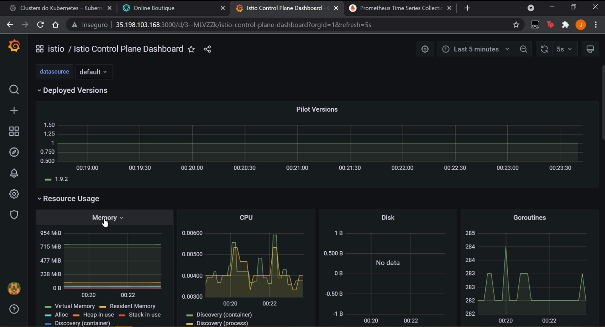
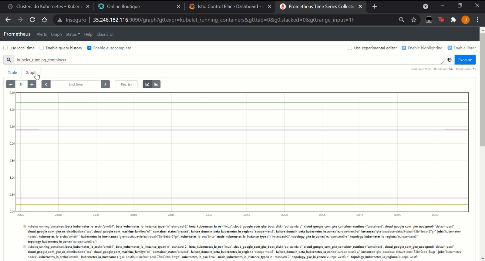

# Project Name

AGISIT 2021-2022

## Authors

**TEAM 14T**

| Number | Name              | Username                                        | Email                                               |
| -------|-------------------|-------------------------------------------------| ----------------------------------------------------|
| 102124 | Daniel Dias       | <https://git.rnl.tecnico.ulisboa.pt/ist1102124> | <mailto:daniel.g.dias@tecnico.ulisboa.pt>           |
| 98722  | Miguel Figueiredo | <https://git.rnl.tecnico.ulisboa.pt/ist198722>  | <mailto:miguel.r.figueiredo@tecnico.ulisboa.pt>     |
| 90106  | João Borges       | <https://git.rnl.tecnico.ulisboa.pt/ist190106>  | <mailto:joaomborges@tecnico.ulisboa.pt>       

### Module leaders

For each module, the README file must identify the lead developer and the contributors.
The leads should be evenly divided among the group members.

### Module leaders
- Designing the Architeture of the solution: João Borges
- Provisioning of the Infrastuture: Miguel Figueiredo
- Deployment of the Applications: Daniel Dias

In the beggining, we chose who was responsible for each area/function, however we all had the same workload in the development of the project in order to better understand and learn every major aspect of the project. In short, the module leaders were useful for the organization of our project as a whole.

### Prerequisites
- Docker
- Vagrant
- Kubectl
- ISTIO
- Terraform
- GCP

### Installing

Navigate to the repository of the project and apply the following commands:
1- vagrant up - Create/Initializes a VM machine with the specification in the Vagrant File.
2- vagrant ssh mgmt - Establishes a SSH Connection with the VM machine (mgmt).
3- cd "directory of the .tf files" - Navigate to the main folder.
4- gcloud auth login - Authenticates te cloud int the mgmt machine.
5- terraform init - Initializes/Install the plugins needed.
6- terraform plan - Verifies the specifications of the project.
7- terraform apply - Runs the Terraform files of the project. Provisioning of the Infrastructure and Deployment of the Application.
8- gcloud container clusters get-credentials "cluster_name" --zone "project_zone" --project "project_ID" & Connects the console with the Kubernetes Cluster.

    

## Built With

* [Tool](https://tool.name.org/) - Build Tool and Dependency Management
* [Vagrant](https://www.vagrantup.com/)
* [Terraform](https://www.terraform.io/)
* [Kubectl](https://www.kubernetesio.com)
* [ISTIO](https://istio.io/)
* [Docker](https://www.docker.com)
* [GCP Cloud](https://cloud.google.com/)

## Versioning

We use [RNL Git](https://git.rnl.tecnico.ulisboa.pt/AGISIT-21-22/team-14T/) for versioning.
