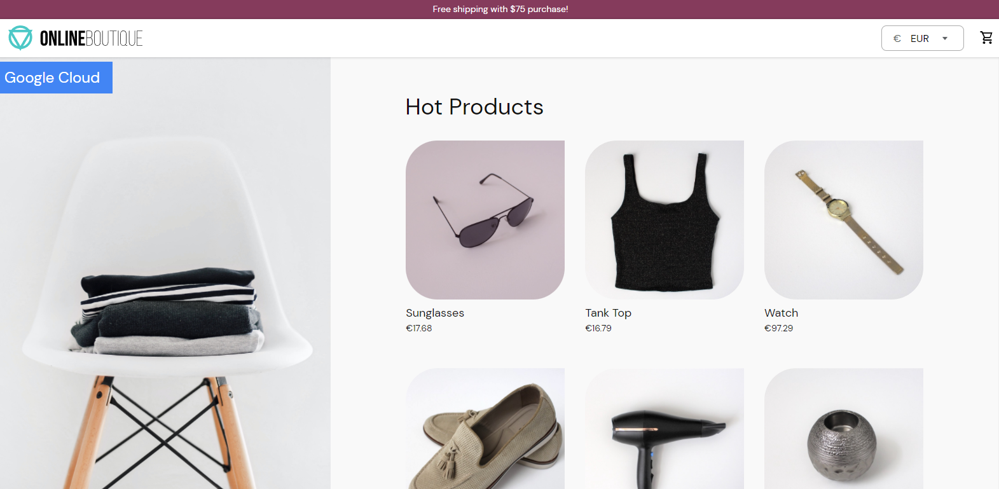
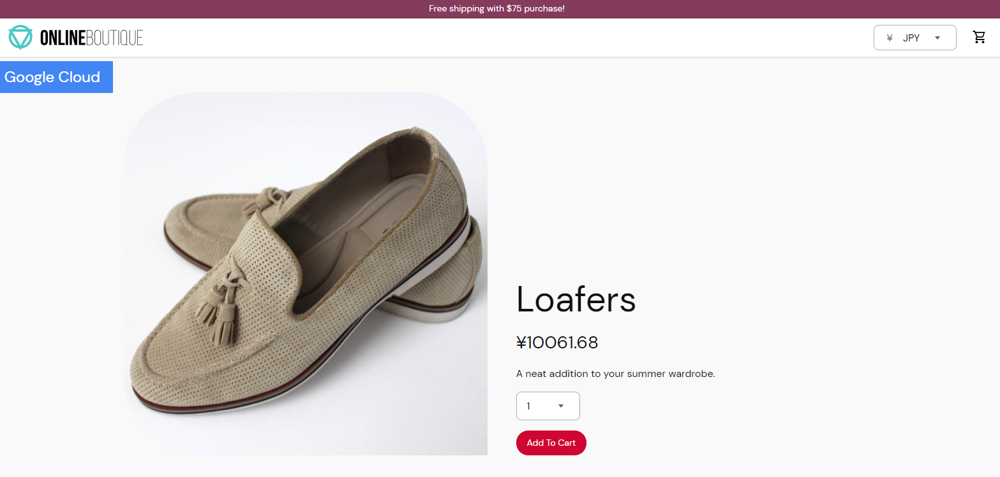
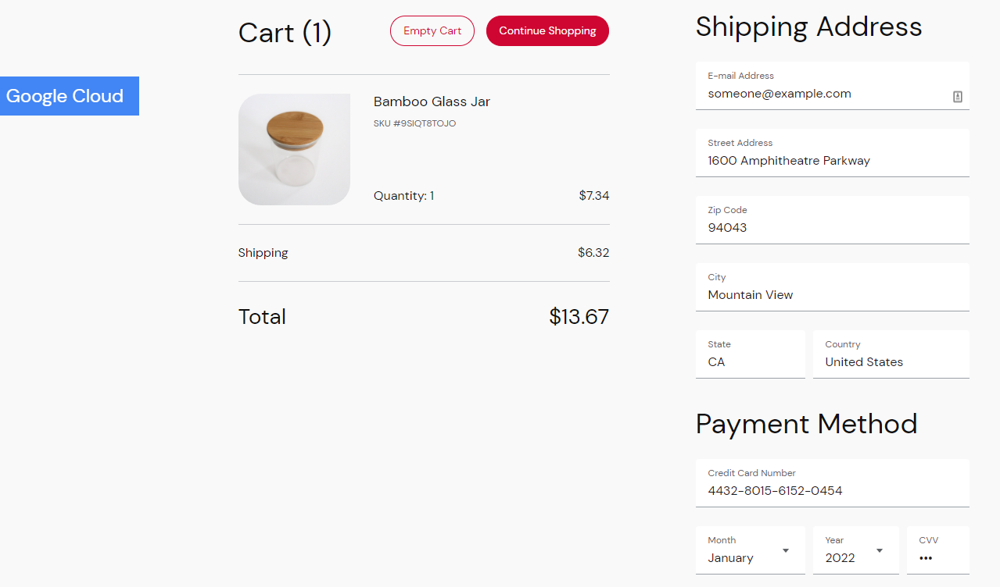

# Project Name

AGISIT 2021-2022

## Authors

**TEAM 14T**

| Number | Name              | Username                                        | Email                                               |
| -------|-------------------|-------------------------------------------------| ----------------------------------------------------|
| 102124 | Daniel Dias       | <https://git.rnl.tecnico.ulisboa.pt/ist1102124> | <mailto:daniel.g.dias@tecnico.ulisboa.pt>           |
| 98722  | Miguel Figueiredo | <https://git.rnl.tecnico.ulisboa.pt/ist198722>  | <mailto:miguel.r.figueiredo@tecnico.ulisboa.pt>     |
| 90106  | João Borges       | <https://git.rnl.tecnico.ulisboa.pt/ist190106>  | <mailto:joaomborges@tecnico.ulisboa.pt>             |

### Note
We had some problems with the Online Calculator Files so we decided to change the App and use the Online Boutique.
We also changed the architecture of the Infrastructure and the Deployment in order to match with the necessity of the problem and application.

### Module leaders
- Designing the Architeture of the solution: João Borges
- Provisioning of the Infrastuture: Miguel Figueiredo
- Deployment of the Applications: Daniel Dias

In the beggining, we chose who was responsible for each area/function, however we all had the same workload in the development of the project in order to better understand and learn every major aspect of the project. In short, the module leaders were useful for the organization of our project as a whole.

### Prerequisites
- Docker
- Vagrant
- Kubectl
- Terraform
- GCP

### The Architecture 
    We choose the Online Boutique App.
    We used a Kubernetes Cluster in GCP Cloud with 4 Worker Nodes that run 11 microservices.
    Those microservices are:
        - Frontend, responsible for exposing an HTTP server to serve the website.
        - Cartservice, responsible for storing the items in the shopping cart in Redis.
        - Productcatalogservice, responsible for providing the list of products from a JSON file and searching products.
        - Currencyservice, responsible for converting money currencies.
        - Paymentservice, responsible for charging the credit card for the purchase.
        - Shippingservice, responsible for giving shipping cost based on the shopping cart and ships the items.
        - Emailservice, responsible for sending users the order confirmation email.
        - Checkoutservice, responsible for retrieving user shopping cart, preparing the order and payement and the email notification.
        - Recommendationservice, responsible for recommending other products based on the shopping cart.
        - Adservice, responsible for providing text ads.
        - Loadgenerator, responsible for sending constant requests imitating realistic user flows to the frontends.
    We are using terraform to configure and manage the infrastructure, creating a cluster for the microservices.
    We are using Kubernetes to automate the deployment, scaling and management of the aplication.

## Project Files
    To do the provisioning of the infrastructure, we use the following tools:
        - Terraform: To create our kubernetes cluster and their worker nodes.
        - GKE: We use the Goolge Cloud Platfrom API 'Google Kubernetes Engine'
        - GCP: We use as our Public Cloud of choice the Google Cloud Platform.
    In these phase of the project we created 3 Terraform files to specify the cluster, that are the following:
        - variables.tf: In these file we specified the variables  that we are gonna use multiple times during the configuration of the files like the name of the cluster, the ID of the project, the number of nodes that are gonna be created and the region of the GCP server that are gonna be created.
        - provider.tf: In this file, we specify the GCP project where we want to provision our infrastructure (Kubernetes Cluster) and the file with the credentials of the project.
        - main.tf: In this file, we specify the criation of the cluster. In it, we instantiate the name of the cluster, the ID of the project where the cluster will be provisioned nad the GCP region where the cluster will reside. Right after, we specify the criation of each node, already within the cluster.

    To proceed with the deployment of the application, we used the following tools:
        - GKE: To deploy our application (Online Boutique) within our Kubernetes cluster, we used the GKE. The files that specify the construction of the application are the YAML files that come with the Boutique files.
    In this phase, we used the YAML files and the Docker images of the application to build our application in the Kubernetes Cluster.

## Deployment
    Navigate to the repository of the project and apply the following commands:
        1- vagrant up
        2- vagrant ssh mgmt
        3- cd "directory of the .tf files"
        4- authentication of the cloud in the mgmt machine
        5- terraform init
        6- terraform plan
        7- terraform apply
        8- gcloud container clusters get-credentials agisit-cluster --zone europe-west1-b --project coral-marker-331122
        9- kubectl apply -f ./release/kubernetes-manifests.yaml

   

## Built With
* [Docker](https://www.docker.com)
* [Kubectl](https://www.kubernetesio.com) 

## Versioning
We use [RNL Git](https://git.rnl.tecnico.ulisboa.pt/AGISIT-21-22/team-14T) for versioning.
