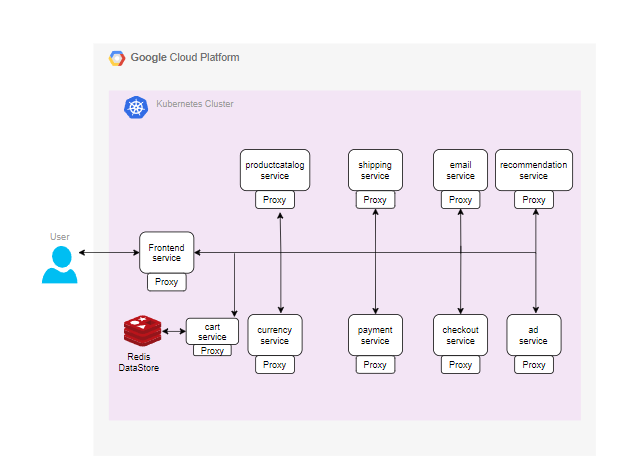

# Project Name

AGISIT 2021-2022

## Authors

**TEAM 14T**

| Number | Name              | Username                                        | Email                                               |
| -------|-------------------|-------------------------------------------------| ----------------------------------------------------|
| 102124 | Daniel Dias       | <https://git.rnl.tecnico.ulisboa.pt/ist1102124> | <mailto:daniel.g.dias@tecnico.ulisboa.pt>           |
| 98722  | Miguel Figueiredo | <https://git.rnl.tecnico.ulisboa.pt/ist198722>  | <mailto:miguel.r.figueiredo@tecnico.ulisboa.pt>     |
| 90106  | João Borges       | <https://git.rnl.tecnico.ulisboa.pt/ist190106>  | <mailto:joaomborges@tecnico.ulisboa.pt>             |

### Module leaders
- Designing the Architeture of the solution: João Borges
- Provisioning of the Infrastuture: Miguel Figueiredo
- Deployment of the Applications: Daniel Dias

Definimos os lideres para cada área/função, no entanto todos terão a mesma carga de trabalho em cada uma das fases de desenvolvimento, de modo a garantirmos a melhor compreensão e aprendizagem de todos os pontos do projeto/matéria, servindo os lideres apenas para facilitar a organização de cada etapa.

## Getting Started
Escolhemos fazer a app da calculadora e para tal iremos implementar 4 micro-serviços. 
Os micro seviços são:
    - Bootstorage, responsável por armazenar as operações realizadas e devolve-las por ordem de execução
    - Expressed, responsável pelas operações de soma e subtrair
    - Happy, responsável pelas operações de multiplicação e divisão
    - Vuecalc, responsável pela interface gráfica.
Iremos utilizar o terraform para configurar e gerir a infraestrutura, criando uma vpc para micro-serviços.
Iremos utilizar o Kubernetes para automatizar a implementação, dimensionamento e gestão da aplicação.

### Prerequisites
- Docker
- Maven
- NPM
- Kubectl
- Terraform
- GCP

### Installing
Depois de instalar o docker, maven e os restantes pré-requisitos basta executar o seguinte ficheiro:   - build-deploy.sh

## Built With
* [Docker](https://www.docker.com)
* [Maven](https://www.maven.apache.org)
* [NPM](https://www.nodejs.org) 
* [Kubectl](https://www.kubernetesio.com) 

## Project Files
locals.tf -> variáveis do projeto
projects.tf -> criar os projetos
vpc.tf -> criar a virtual private cloud para as máquinas
router.tf -> criar um router virtual para permitir que as máquinas dentro da vpc comuniquem com o exterior
nat.tf -> configurar o router
shared-vpc.tf -> associar os projetos à vpc que foi criada
kubernetes.tf -> criar o container cluster dos nodes (máquinas dentro da vpc)

## Deployment
Ir até ao repositório do projeto e aplicar os seguintes comandos: 
    1- vagrant up
    2- vagrant ssh mgmt
    3- cd "diretorio dos ficheiros .tf"
    3- terraform init
    4- terraform plan
    5- terraform apply

## Versioning
We use [RNL Git](https://git.rnl.tecnico.ulisboa.pt/AGISIT-21-22/team-14T) for versioning.
